# Dependency Graph

```mermaid
graph TD
  Api["AiStartupOs.Api"]

  SharedKernel["SharedKernel"]
  BB_Domain["BuildingBlocks.Domain"]
  BB_App["BuildingBlocks.Application"]
  BB_Persistence["BuildingBlocks.Persistence"]
  BB_Messaging["BuildingBlocks.Messaging"]
  BB_Web["BuildingBlocks.Web"]

  Api --> BB_Web
  Api --> BB_App
  Api --> BB_Messaging
  Api --> SharedKernel

  BB_App --> BB_Domain
  BB_App --> SharedKernel
  BB_Persistence --> BB_Domain
  BB_Persistence --> BB_App
  BB_Persistence --> SharedKernel
  BB_Messaging --> SharedKernel
  BB_Web --> BB_App
  BB_Web --> SharedKernel

  subgraph Modules
    Identity["Modules.Identity.*"]
    StartupIdeas["Modules.StartupIdeas.*"]
    ValidationEngine["Modules.ValidationEngine.*"]
    ResearchEngine["Modules.ResearchEngine.*"]
    PersonaEngine["Modules.PersonaEngine.*"]
    PricingEngine["Modules.PricingEngine.*"]
    RoadmapEngine["Modules.RoadmapEngine.*"]
    LandingPageGenerator["Modules.LandingPageGenerator.*"]
    FounderCopilot["Modules.FounderCopilot.*"]
    Billing["Modules.Billing.*"]
  end

  Api --> Identity
  Api --> StartupIdeas
  Api --> ValidationEngine
  Api --> ResearchEngine
  Api --> PersonaEngine
  Api --> PricingEngine
  Api --> RoadmapEngine
  Api --> LandingPageGenerator
  Api --> FounderCopilot
  Api --> Billing
```

Each module follows the internal layering:
`Presentation -> Infrastructure -> Application -> Domain -> SharedKernel`, with module-specific `Contracts` available for cross-module integration.
